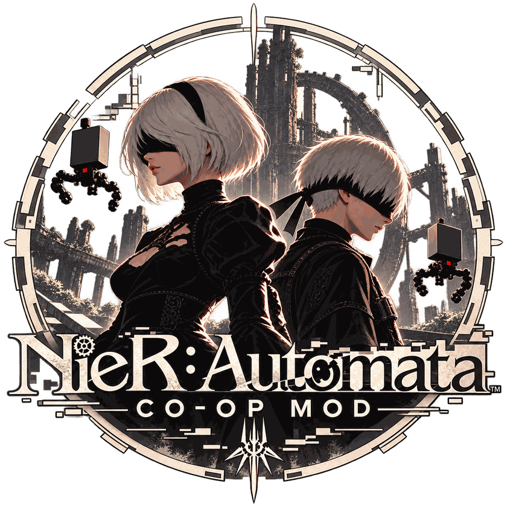

<p align="center">
  
</p>

<h1 align="center">nier-coop</h1>

<p align="center">
  Сюжетный кооператив на двоих для NieR:Automata<br>
  <sub>Two-player story co-op for NieR:Automata, based on <a href="https://github.com/praydog/AutomataMP">AutomataMP</a></sub>
</p>

<p align="center">
  
  
  
  <a href="LICENSE"></a>
</p>

---

**nier-coop** — мод, который позволяет двум друзьям пройти **весь сюжет NieR:Automata вместе**, максимально близко к оригинальной игре. Каждый играет своего сюжетного героя, а не клона: в маршруте A один игрок — 2B, второй — 9S, который и так всегда рядом с ней.

Проект — форк [**AutomataMP**](https://github.com/praydog/AutomataMP) от [praydog](https://github.com/praydog): мультиплеерного мода, который синхронизирует игроков, анимации, Pod и врагов. nier-coop развивает его в сторону полноценного сюжетного кооператива.

> [!WARNING]
> Ранняя альфа. Синхронизации сюжета пока нет: каждый проходит сюжет в своей игре, и игры могут разойтись. Делайте резервные копии сохранений.

## Содержание

- [Как это задумано](#как-это-задумано)
- [Что уже работает](#что-уже-работает)
- [Установка](#установка)
- [Как играть](#как-играть)
- [Свой сервер](#свой-сервер)
- [Сборка из исходников](#сборка-из-исходников)
- [Документация](#документация)
- [Благодарности и лицензия](#благодарности-и-лицензия)

## Как это задумано

| Маршрут | Host | Client |
|---|---|---|
| **A** | 2B, ведёт сюжет | 9S — сюжетный напарник |
| **B** | 9S, ведёт сюжет | 2B |
| **C** | A2 или 9S | второй герой; сегменты проходятся параллельно, в точках синхронизации игроки ждут друг друга |

- **Host ведёт сюжет**: катсцены и сюжетные триггеры идут от его игры, игра Client следует за ним.
- **Режим наблюдателя**: если героя Client в сцене по сюжету нет, Client смотрит на Host, а не получает «лишнего» персонажа.
- **Без PvP в открытом мире**: урона друг другу нет. PvP только в финальной дуэли A2 против 9S.
- **Ровно два игрока**: всё проектируется под пару.

Полное описание — в [`docs/COOP_CONCEPT.md`](docs/COOP_CONCEPT.md).

## Что уже работает

- Подключение из меню **Co-op**: Host запускает сервер прямо из игры или оба подключаются к выделенному серверу.
- **Захват сюжетного напарника**: в игре каждого игрока story buddy (например, 9S рядом с 2B) становится персонажем второго игрока. Напарник возвращается игре в катсценах, при смене напарника по сюжету и когда игроки далеко друг от друга.
- Синхронизация от AutomataMP: позиция, поворот, анимации, стрельба и программы Pod, фонарик, выбор оружия.
- Общие враги от Host — экспериментально, за галочкой.
- Выделенный сервер на Go для Linux и Windows, защищённый паролем.

Что в работе — в [`docs/TASKS.md`](docs/TASKS.md).

## Установка

Готовых сборок пока нет (планируются в GitHub Releases), DLL нужно [собрать](#сборка-из-исходников).

1. Скопируйте `dinput8.dll` в папку игры, например `C:\Program Files (x86)\Steam\steamapps\common\NieRAutomata`.
2. Если хотите хостить игру со своего ПК, положите собранный сервер `server.exe` в папку `automatamp_server\` внутри папки игры.
3. Запустите игру. Меню мода открывается клавишей **Insert**.

Логи мода пишутся в папку игры: `automatamp_log*.txt`, по одному на каждую запущенную копию.

## Как играть

Оба игрока загружают **одно и то же сохранение**.

**Через выделенный сервер** (проще всего, ничего не нужно пробрасывать):
1. Оба открывают меню **Co-op**, вводят имя и пароль сервера, в поле **Host address** — `IP:порт` сервера, и нажимают **Join Game**.
2. Host заходит в мир **первым**: пока явный выбор роли не сделан, ведущим сюжета становится тот, кто первым оказался в мире.

**Со своего ПК:**
1. Host нажимает **Host Game**. Меню покажет адреса, которые нужно передать напарнику.
2. Client вводит адрес и нажимает **Join Game**.
3. Через интернет нужен проброс UDP-порта (по умолчанию 6969) или VPN вроде Radmin VPN, ZeroTier или Tailscale.

Подключаться можно прямо из главного меню: персонаж появится, когда вы окажетесь в мире.

## Свой сервер

Сервер лежит в [`server/`](server/) и работает по UDP (ENet). Ему хватает 1 vCPU и 512 МБ RAM, а пинг важнее мощности железа.

```bash
sudo apt install golang libenet-dev pkg-config
cd server
go build -o server main.go
./server -mode server
```

Настройки — в `server/server.json`: `password`, `name`, `port`. На публичном IP пароль обязателен. Готовый systemd-юнит и скрипт обновления по SSH лежат в [`server/deploy/`](server/deploy/).

## Сборка из исходников

Нужны Windows, Visual Studio 2022 (C++), CMake 3.15+ и Git.

```bat
git clone --recursive https://github.com/egoriyNovikov/nier-coop.git
cd nier-coop
cmake -S . -B build -G "Visual Studio 17 2022" -A x64
cmake --build build --config Release --target automatamp
```

Результат: `build/bin/automatamp/dinput8.dll`. Сервер для Windows собирается командой `go build -o server.exe main.go` в папке `server/` (нужны Go и gcc, например из Scoop).

## Документация

| Файл | О чём |
|---|---|
| [`docs/COOP_CONCEPT.md`](docs/COOP_CONCEPT.md) | Концепт: роли по маршрутам, синхронизация сюжета, решения |
| [`docs/TASKS.md`](docs/TASKS.md) | План задач, вехи, как тестировать |
| [`server/README.md`](server/README.md) | Параметры сервера |

## Благодарности и лицензия

- [**praydog**](https://github.com/praydog) — автор [AutomataMP](https://github.com/praydog/AutomataMP), на котором построен этот мод: реверс игры, SDK, сетевой код и сервер.
- Участники AutomataMP: [cursey](https://github.com/cursey), Lizardy, [RutsuKun](https://github.com/RutsuKun), Kimiblock, microsoftv.
- Библиотеки: [safetyhook](https://github.com/cursey/safetyhook), [ENet](https://github.com/lsalzman/enet), [flatbuffers](https://github.com/google/flatbuffers), [Dear ImGui](https://github.com/ocornut/imgui), [spdlog](https://github.com/gabime/spdlog), [glm](https://github.com/g-truc/glm), [mruby](https://github.com/mruby/mruby).

Код распространяется по [лицензии MIT](LICENSE), как и оригинальный AutomataMP.

Это фанатский проект, он не связан с Square Enix и PlatinumGames. NieR:Automata — торговая марка Square Enix. Логотип мода — фан-арт.
